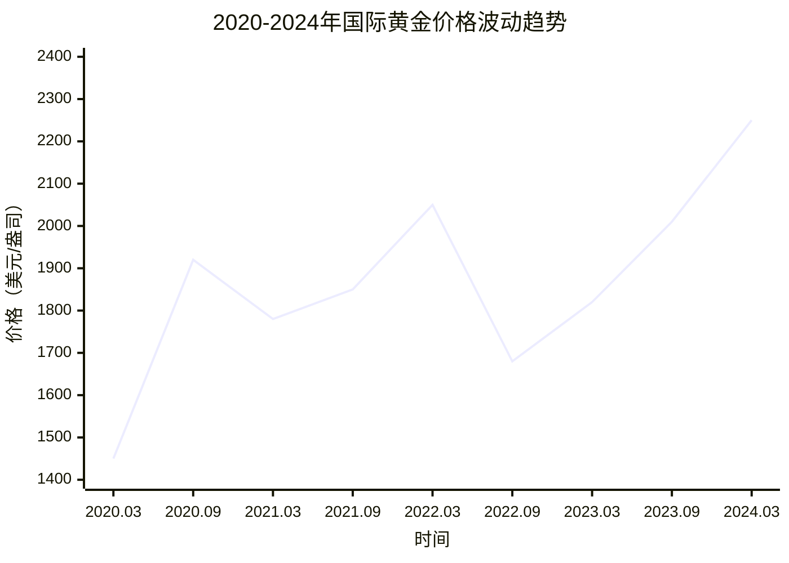

# 黄金：稳健投资的压舱石

在风云变幻的投资市场中，黄金始终以独特的价值属性，成为投资者心中的 “安全港”。无论是全球经济动荡还是地缘政治冲突，黄金的避险功能总能凸显，为资产组合筑起一道坚固防线。

## 一、黄金价值的核心根基：稀缺性与抗通胀力

黄金的价值并非凭空而来，其核心支撑源于两大特性：稀缺性与不可再生性。不同于纸币可由央行随意增发，黄金的全球储量有限，且开采难度大、成本高昂，这从根本上决定了它具备对抗通胀的天然优势。

当物价持续上涨、货币购买力不断贬值时，黄金价格往往会同步攀升，成为对冲资产缩水的重要工具。2020
年全球疫情爆发初期，各国央行纷纷推出大规模放水政策刺激经济，过量的货币供应推高通胀预期，国际金价在此背景下半年内涨幅超
30%，用实际表现印证了其 “抗通胀利器” 的地位。

下图为 2020-2024 年国际黄金价格（单位：美元 / 盎司）月度均值折线图，清晰呈现黄金价格与重大事件的关联：

## 二、黄金在投资组合中的关键作用

作为多元化投资的重要标的，黄金在资产配置中扮演着不可或缺的角色，主要体现在两个方面：

### 1. 降低组合风险，实现逆势平衡

黄金与股票、债券等传统资产的关联性极低。结合上图可见，2022 年 3 月俄乌冲突期间，全球股市普遍下跌（如美股标普 500 当月跌幅超
5%），而黄金价格却冲高至 2050 美元 / 盎司，有效抵消了股票资产的亏损，平衡整体投资组合（portfolio）的风险。

据市场数据统计，在投资组合中配置 5%-10% 的黄金，长期波动率可降低 15%-20%，显著提升组合的稳健性，避免因单一资产波动导致的大幅亏损。

### 2. 强流动性保障，满足应急需求

黄金的全球交易市场 24
小时不间断运行，无论是实物黄金还是电子化黄金产品，都能快速变现，流动性远超房产、部分收藏品等资产。这一特性在投资者面临紧急资金需求时尤为关键，可确保资产在短时间内转化为现金，避免陷入资金链紧张的困境。

## 三、黄金投资的风险与合理参与方式

尽管黄金优势显著，但从折线图也能看出，其价格并非单向上涨 ——2022 年 9 月至 2023 年 3 月，受美联储持续加息影响，金价从 1680
美元 / 盎司回落，盲目追高易造成损失。黄金价格主要受三大因素影响：

* 美元汇率：美元走强时（如 2022 年美联储加息周期），黄金通常承压；

* 货币政策：加息周期中黄金吸引力下降，降息预期则推动金价上涨（如 2024 年 3 月走势）；

* 地缘冲突：突发冲突会短期推高避险需求，带动金价冲高。

对普通投资者而言，可根据自身风险承受能力选择参与方式：

* 实物黄金：如金条、金币，适合追求资产实物持有、注重长期保值的投资者；

* 黄金 ETF：通过证券账户购买，交易便捷、成本较低，适合希望灵活参与市场的投资者；

* 纸黄金：由银行推出的记账式黄金产品，无实物交割压力，适合短期交易型投资者。

## 四、总结：理性配置，守护财富安全

从 2020-2024 年的价格折线图可见，黄金在经济动荡、政策调整等关键节点均展现出较强的抗风险能力。在全球经济不确定性加剧的当下，黄金已不再是单一的保值工具，更成为资产配置中不可或缺的
“压舱石”。

投资者需理性看待黄金的投资价值，避免过度依赖或忽视 —— 既不盲目追涨短期冲高的金价，也不忽视其长期对冲风险的作用，通过合理规划
5%-10% 的配置比例，将黄金纳入整体投资策略，方能在市场波动中把握稳健收益，切实守护财富安全。

> （注：文档部分内容可能由 AI 生成）